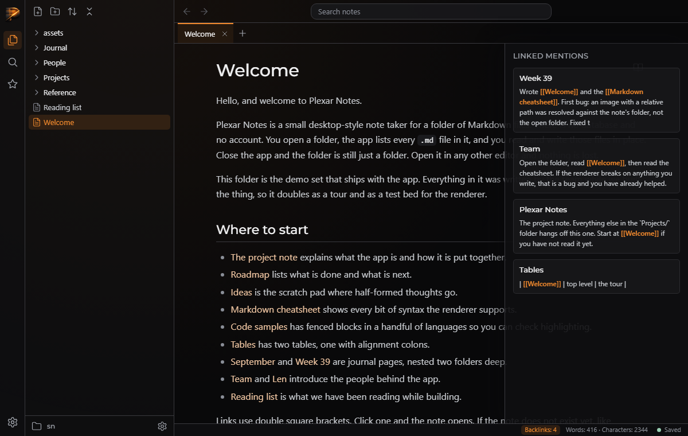

# QA — T-0c092d2efd

> **About this report.** The review chain ran, checked and photographed this work to get you through QA faster, and it is usually right. It is still AI judgement, and it is not a replacement for yours: results depend on how the task was prompted and on your project, and what works reliably for us may not for you. **Treat every AI verdict below as a lead to confirm, not a sign-off.** Your verdicts are recorded, and they are what makes the next report more accurate.

Generated 2026-09-26T10:31:29-04:00 by the review chain.

**Task:** This repo is Plexar Notes, a desktop-style Markdown note taker laid out like Obsidian, with a Plexar look. Server: server/server.js (Node standard library only) exports createServer(root); routes in server/routes.js; there is an in-memory note cache used by GET /api/search (invalidated on writes). lib/backlinks.js (ES module) exports buildIndex(notes:[{path, content}]) and backlinksFor(index, path) → [{from, title, context}]. The browser app in public/ has a status bar `<footer id="statusbar">` showing 'Backlinks: 0' (placeholder), word/character counts and the saved indicator; notes open thro

**Branch:** `plexar/T-0c092d2efd` · **commit:** `7385e696ef06` · **chain result:** `approved`

Record your verdict per case in `/app` (open the task, then *QA cases*), or edit *Your status* here.

## 1 · Seen by the AI: confirm what it claims to see (VISUAL)

| ID | Section | Test | Class | AI verdict | Your status | What the AI observed | Commit | What & how to test |
|---|---|---|---|---|---|---|---|---|
| QA-2 | Status bar and panel | count, open panel, click source, Escape/toggle close, active state | VISUAL | pass | PENDING | All asserts passed; screenshot shows docked panel with accent [[links]] and highlighted button | 7385e696ef | python qa/evidence/T-0c092d2efd/drive_backlinks.py (server on 4587 with a copy of sample-notes) — expect: Backlinks: 4; panel lists 4 with accent links; closes on Escape or second click |

**QA-2** — count, open panel, click source, Escape/toggle close, active state



## 2 · Needs your eyes: the AI could not capture it (MANUAL)

None.

## 3 · Proven by a command (AUTO: backend smoke)

Re-runnable; these belong in the larger QA as regression checks. Spot-check any you doubt.

| ID | Section | Test | Class | AI verdict | Your status | What the AI observed | Commit | What & how to test |
|---|---|---|---|---|---|---|---|---|
| QA-1 | API | backlinks endpoint and tests | AUTO | pass | VERIFIED (chain) | 164/164 pass; count 4 | 7385e696ef | node --test; curl /api/backlinks?path=Welcome.md — expect: green; count 4 |

## The chain, hop by hop

| hop | attempt | stage | model | verdict | judgement | feedback |
|---|---|---|---|---|---|---|
| 1 | 1 | verifier | sonnet | **pass** | Full suite passes (164/164), the new API tests pass, and a headless browser run against sample-notes confirmed the count, the docked panel, accent link text, opening a source note, Escape and toggle closing, and the active button state. The empty state was not exercised in the browser. |  |
| 2 | 1 | approver | opus | **approve** | The endpoint, index rebuild on cache change, 404/400 handling, tests and the status-bar button/panel (title, empty state, accent link text, click-to-open, Escape/toggle close, active state, refresh on open/save/rename) all match the task, and the tests I re-ran pass. Remaining nits (a failed request leaves the old count; Escape in other widgets may also close the panel) are minor. |  |

## Evidence the reviewers recorded

**hop 1 (verifier)** `node --test`

```
tests 164, pass 164, fail 0
```

**hop 1 (verifier)** `curl localhost:4587/api/backlinks?path=Welcome.md`

```
count 4 with from/title/context for Week 39, Team, Plexar Notes, Tables
```

**hop 1 (verifier)** `python qa/evidence/T-0c092d2efd/drive_backlinks.py`

```
Backlinks: 4 shown; panel opens with 4 items; click opens source (count 7, Week 39); Escape and double-click toggle close; OK
```

**hop 2 (approver)** `node --test tests/server.backlinks.test.js tests/style.test.js`

```
tests 7, pass 7, fail 0 (incl. 'a missing note is 404, an unsafe or non-Markdown path is 400', 'no hard-coded colours outside the tokens file')
```

**hop 2 (approver)** `Grep --titlebar-height|--tabbar-height|position: relative in public/css`

```
layout.css:7-8 defines --titlebar-height 40px / --tabbar-height 36px; tabs.css:3-4 #main { position: relative } so the absolutely positioned #backlinks docks under the tab bar at the right of main
```

**hop 2 (approver)** `Grep Escape in public/js`

```
handlers in tree.js, search.js, app.js:701, menu.js; backlinks.js:121 skips defaultPrevented events
```

