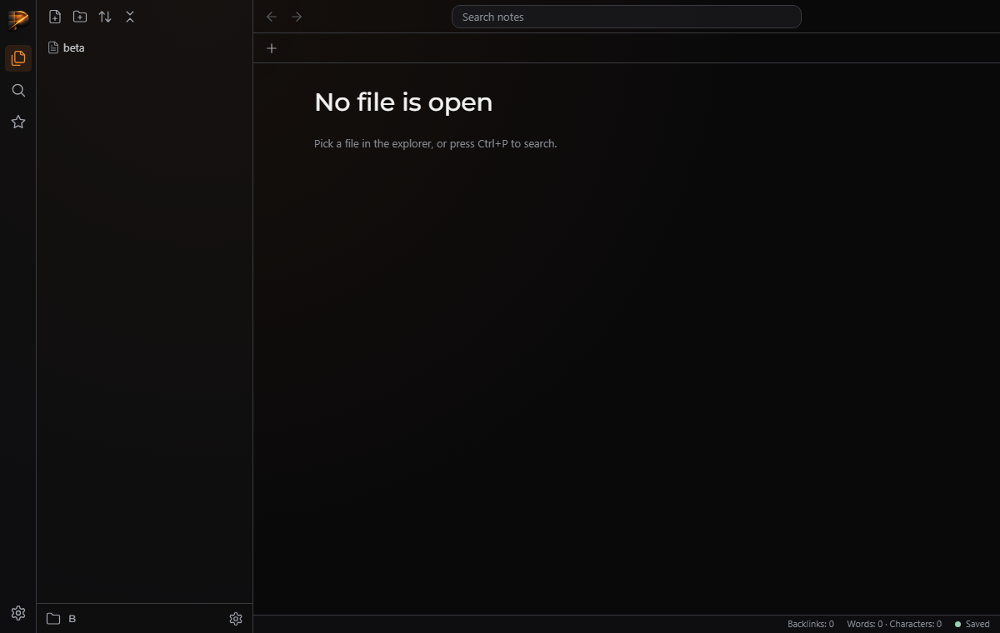

# QA — T-1acfb3b4db

> **About this report.** The review chain ran, checked and photographed this work to get you through QA faster, and it is usually right. It is still AI judgement, and it is not a replacement for yours: results depend on how the task was prompted and on your project, and what works reliably for us may not for you. **Treat every AI verdict below as a lead to confirm, not a sign-off.** Your verdicts are recorded, and they are what makes the next report more accurate.

Generated 2026-09-26T10:25:51-04:00 by the review chain.

**Task:** This repo is Plexar Notes, a desktop-style Markdown note taker laid out like Obsidian, with a Plexar look. Server: server/server.js (Node standard library only) exports createServer(root); routes in server/routes.js: GET /api/tree, GET/PUT/POST/DELETE /api/file, POST /api/folder, POST /api/rename {from,to}, DELETE /api/folder, GET /api/search, GET /files/<path>; every relative path is guarded by lib/paths.js safeJoin. The browser app in public/: explorer panel (public/js/tree.js) with header icon buttons New note, New folder, Sort, Collapse all (some may be placeholders), a folder tree, and at

**Branch:** `plexar/T-1acfb3b4db` · **commit:** `7bcb244daca3` · **chain result:** `approved`

Record your verdict per case in `/app` (open the task, then *QA cases*), or edit *Your status* here.

## 1 · Seen by the AI: confirm what it claims to see (VISUAL)

| ID | Section | Test | Class | AI verdict | Your status | What the AI observed | Commit | What & how to test |
|---|---|---|---|---|---|---|---|---|
| QA-2 | Explorer | New note, new folder, sort, rename, move, delete, Escape, open folder and settings in the browser | VISUAL | pass | PENDING | all asserts passed with no page errors; I viewed the picker and delete-confirm screenshots and they match the look | 7bcb244dac | python qa/evidence/T-1acfb3b4db/drive_verify.py before; python qa/evidence/T-1acfb3b4db/drive_verify.py after — expect: all asserts pass and the screens match the look |

**QA-2** — New note, new folder, sort, rename, move, delete, Escape, open folder and settings in the browser



## 2 · Needs your eyes: the AI could not capture it (MANUAL)

None.

## 3 · Proven by a command (AUTO: backend smoke)

Re-runnable; these belong in the larger QA as regression checks. Spot-check any you doubt.

| ID | Section | Test | Class | AI verdict | Your status | What the AI observed | Commit | What & how to test |
|---|---|---|---|---|---|---|---|---|
| QA-1 | Server | open-folder and folders endpoints | AUTO | pass | VERIFIED (chain) | 5 of 5 pass (per the gate output; the full run passes 159/159) | 7bcb244dac | node --test tests/server.open-folder.test.js — expect: all pass |

## The chain, hop by hop

| hop | attempt | stage | model | verdict | judgement | feedback |
|---|---|---|---|---|---|---|
| 1 | 1 | verifier | sonnet | **fail** | With nothing selected, New note and New folder target the first folder in the tree (focus is mistaken for selection) instead of the root, which breaks item 2. Rename, move, delete and the picker were not exercised in a browser because the run stopped at this failure. | Separate real selection from roving-tabindex focus. Track selection only on click, on keyboard activation, or after an action, and use it in tree.selected(). With nothing selected, New note and New folder must target the root. Then re-verify rename, move, delete and open folder in a browser. |
| 2 | 2 | verifier | sonnet | **pass** | node --test is green (159/159) and a Playwright drive of the real app passed for new note, new folder, sort, rename, move, delete, Escape, open folder and settings, with no page errors or native dialogs. |  |
| 3 | 2 | approver | opus | **approve** | The server's open-folder routes meet the spec (absolute existing directory or 400, root switch, search cache cleared, folder listing with parent and no hidden entries) and are covered by the new test file. The in-app menu, dialogs and picker were exercised in a real browser with screenshots, and node --test is green. |  |

## Evidence the reviewers recorded

**hop 1 (verifier)** `node --test`

```
tests 159, pass 159, fail 0
```

**hop 1 (verifier)** `python qa/evidence/T-1acfb3b4db/drive_ops.py <tmp>  (server on port 4517 over folder A containing alpha.md and sub/)`

```
AssertionError at assert os.path.exists(T+'/A/Untitled.md')
```

**hop 1 (verifier)** `python /tmp/d.py (fresh page, click #new-note once, then ls A/sub)`

```
POST /api/file 200; sub/ contains Untitled.md, Untitled 2.md, Untitled 3.md; A/ root has none
```

**hop 2 (verifier)** `node --test`

```
tests 159, pass 159, fail 0
```

**hop 2 (verifier)** `python qa/evidence/T-1acfb3b4db/drive_verify.py after`

```
sort Sort: file name (A to Z) -> Sort: file name (Z to A); Delete "gamma"? This cannot be undone.; errs []; OK
```

**hop 3 (approver)** `node --test`

```
tests 159, pass 159, fail 0
```

**hop 3 (approver)** `read server/routes.js lines 470-584`

```
apiOpenFolder: path.isAbsolute check, stat.isDirectory else 400, ctx.root = root, searchCache.clear(); apiListFolders uses os.homedir() when empty, skips names starting with '.', parent null at the top; ctx is shared per handler
```

**hop 3 (approver)** `grep -rniE 'vault|window.(prompt|confirm)|prompt(|confirm(' public server`

```
only a comment in public/js/menu.js saying window.prompt/confirm are not used
```

**hop 3 (approver)** `grep test( tests/server.open-folder.test.js`

```
5 tests: tree of A + GET /api/folder; switch to B; missing/file/relative -> 400 with root unchanged; /api/folders lists subfolders + parent; empty path = home, bad paths 400
```

**hop 3 (approver)** `view qa/evidence/T-1acfb3b4db/13_renamed_tab_updated.png and 16_picker.png`

```
after the rename the tab reads 'gamma' and the tree item is selected; the Open folder dialog has breadcrumb, Up button, editable path input, subfolder list, Open/Cancel on an elevated rounded card
```

