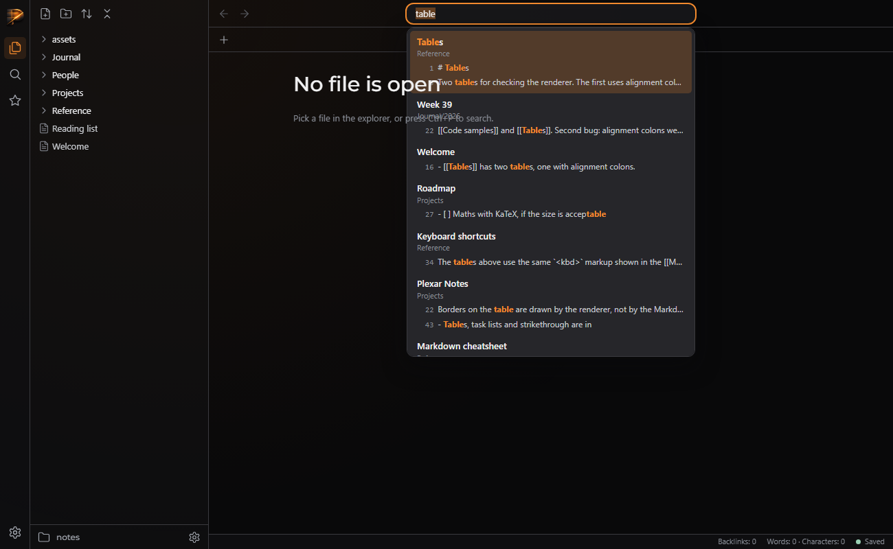

# QA — T-3f1c88a550

> **About this report.** The review chain ran, checked and photographed this work to get you through QA faster, and it is usually right. It is still AI judgement, and it is not a replacement for yours: results depend on how the task was prompted and on your project, and what works reliably for us may not for you. **Treat every AI verdict below as a lead to confirm, not a sign-off.** Your verdicts are recorded, and they are what makes the next report more accurate.

Generated 2026-09-26T10:10:32-04:00 by the review chain.

**Task:** This repo is Plexar Notes, a desktop-style Markdown note taker laid out like Obsidian, with a Plexar look. Server: server/server.js (Node standard library only) with routes in server/routes.js; `createServer(root)` is exported and tests start it on port 0 (see tests/server.files.test.js for the pattern). lib/search.js (ES module) exports search(query, notes, {limit}) → [{path, title, score, matches:[{line, text}]}] and highlight(text, query) → [{text, hit}]. The browser app in public/ has `<input id="search">` in the top centre of the title bar; Ctrl+P and Ctrl+Shift+F already focus it. Notes 

**Branch:** `plexar/T-3f1c88a550` · **commit:** `6a0d24822da9` · **chain result:** `approved`

Record your verdict per case in `/app` (open the task, then *QA cases*), or edit *Your status* here.

## 1 · Seen by the AI: confirm what it claims to see (VISUAL)

| ID | Section | Test | Class | AI verdict | Your status | What the AI observed | Commit | What & how to test |
|---|---|---|---|---|---|---|---|---|
| QA-2 | search UI | Modes, dropdown, hits, selection, Enter opens note, No results, outside click, ribbon focus | VISUAL | pass | PENDING | OK; screenshots show the styled dropdown with bold accent hits, dim folder paths and snippet lines with line numbers; Enter opened the Roadmap note | 6a0d24822d | python qa/evidence/T-3f1c88a550/drive_search.py — expect: all asserts pass |

**QA-2** — Modes, dropdown, hits, selection, Enter opens note, No results, outside click, ribbon focus



## 2 · Needs your eyes: the AI could not capture it (MANUAL)

None.

## 3 · Proven by a command (AUTO: backend smoke)

Re-runnable; these belong in the larger QA as regression checks. Spot-check any you doubt.

| ID | Section | Test | Class | AI verdict | Your status | What the AI observed | Commit | What & how to test |
|---|---|---|---|---|---|---|---|---|
| QA-1 | tests | Full test suite including tests/server.search.test.js and tests/ui.search.test.js | AUTO | pass | VERIFIED (chain) | 154 pass, 0 fail | 6a0d24822d | node --test — expect: exit 0 |

## The chain, hop by hop

| hop | attempt | stage | model | verdict | judgement | feedback |
|---|---|---|---|---|---|---|
| 1 | 1 | verifier | sonnet | **fail** | `node --test` still exits 1: the worker's own UI test rejects the word 'innerHTML' in a comment at public/js/search.js:4. The code does not use innerHTML, but the gate is red. | Reword the comment at public/js/search.js:4 so it does not contain the literal string 'innerHTML', for example 'Text is only ever set through textContent.'. Alternatively, make the test strip comments before checking. Then re-run node --test until it is green. |
| 2 | 2 | verifier | sonnet | **pass** | node --test passes (154/154) and a Playwright run against a copy of sample-notes confirmed the dropdown, both modes, keyboard and mouse handling, No results, Enter-to-open and the ribbon Search icon. |  |
| 3 | 2 | approver | opus | **approve** | All tests pass. The live endpoint on sample-notes ranks title matches first for 'table' and 'roadmap', with line numbers and snippets. Every colour variable the new CSS uses is defined, and the screenshot shows the dropdown built as the task asks. |  |

## Evidence the reviewers recorded

**hop 1 (verifier)** `grep -n innerHTML public/js/search.js; node --test`

```
public/js/search.js:4 matches (a comment); tests 154, pass 153, fail 1 (tests/ui.search.test.js: must not use innerHTML)
```

**hop 2 (verifier)** `node --test`

```
tests 154, pass 154, fail 0
```

**hop 2 (verifier)** `python qa/evidence/T-3f1c88a550/drive_search.py <before-worktree>`

```
OK; every assert passed and there were no page errors
```

**hop 3 (approver)** `node --test`

```
tests 154, pass 154, fail 0
```

**hop 3 (approver)** `node -e (createServer('sample-notes'), GET /api/search for table, roadmap, '', zzqx with limit=5)`

```
"table" 5 results, first Reference/Tables.md score 850.5 {line:1,'# Tables'}; "roadmap" 5 results, first Projects/Roadmap.md score 1050.0; "" 0; "zzqx" 0
```

**hop 3 (approver)** `grep -rnE '--px-(text|radius-sm|font-mono|elev|dim|fg|radius|border|accent|bg):' --include=*.css .`

```
all defined in brand/plexar-tokens.css (lines 14-46)
```

**hop 3 (approver)** `grep -A6 .titlebar-search public/css/*.css`

```
.titlebar-search { position: absolute; ... width: min(420px, ...) }, so the dropdown's absolute top:100% anchors under the box
```

**hop 3 (approver)** `Read qa/evidence/T-3f1c88a550/02_text_mode_snippets.png`

```
dropdown under the box at the same width; hits in bold orange; folder path dimmed; numbered snippets; first item selected with the accent background
```

