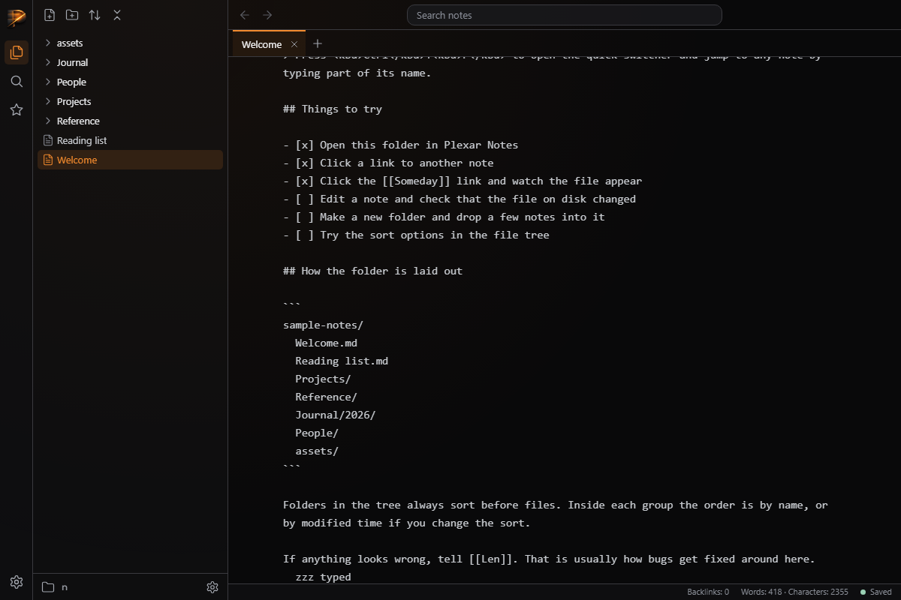
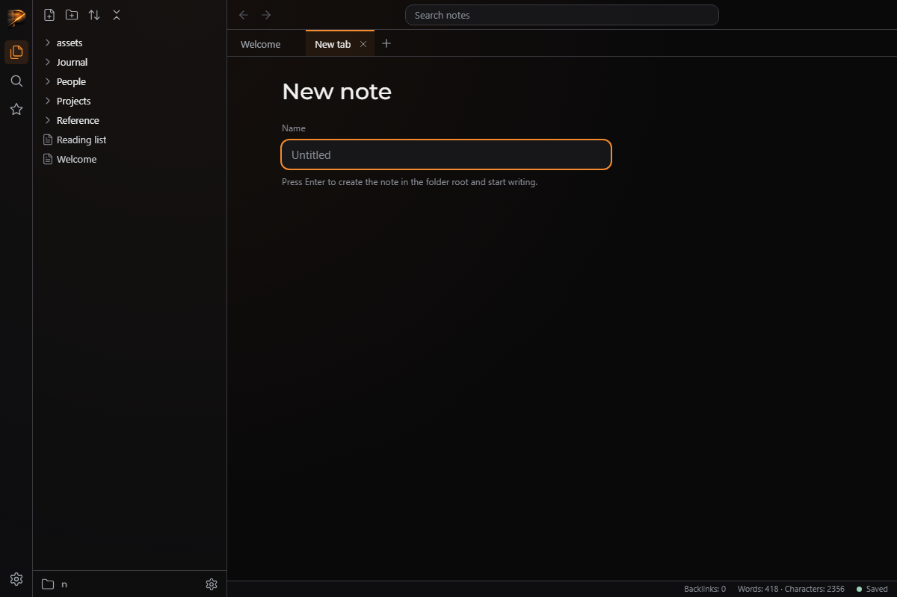

# QA — T-6625425210

> **About this report.** The review chain ran, checked and photographed this work to get you through QA faster, and it is usually right. It is still AI judgement, and it is not a replacement for yours: results depend on how the task was prompted and on your project, and what works reliably for us may not for you. **Treat every AI verdict below as a lead to confirm, not a sign-off.** Your verdicts are recorded, and they are what makes the next report more accurate.

Generated 2026-09-26T10:00:30-04:00 by the review chain.

**Task:** This repo is Plexar Notes, a desktop-style Markdown note taker laid out like Obsidian, with a Plexar look. Server on http://localhost:3000 via `node server/server.js [folder]` (default sample-notes/). API: GET /api/file?path=, PUT /api/file {path, content} → {ok, mtime}. Browser app in public/ (ES modules: app.js, state.js, tree.js, tabs.js, history.js, icons.js, render.js; css under public/css). Reading view already renders notes into #note in a centred 750px column with a toggle icon button at the top right of the note (currently a placeholder). lib/words.js exports stats(markdown) → {words,

**Branch:** `plexar/T-6625425210` · **commit:** `b46e1ada96d1` · **chain result:** `approved`

Record your verdict per case in `/app` (open the task, then *QA cases*), or edit *Your status* here.

## 1 · Seen by the AI: confirm what it claims to see (VISUAL)

| ID | Section | Test | Class | AI verdict | Your status | What the AI observed | Commit | What & how to test |
|---|---|---|---|---|---|---|---|---|
| QA-2 | edit mode | Ctrl+E toggle, Tab, autosave, Ctrl+S, status bar, re-render | VISUAL | pass | PENDING | All asserts passed; file on disk contained typed text; status went Unsaved to Saved | b46e1ada96 | python qa/evidence/T-6625425210/drive_edit.py — expect: asserts pass; disk content updated |
| QA-3 | new note | + tab shows New note prompt; Enter creates and opens in edit mode | VISUAL | pass | PENDING | Created and editor shown | b46e1ada96 | same driver — expect: Brand New.md exists, editor visible |

**QA-2** — Ctrl+E toggle, Tab, autosave, Ctrl+S, status bar, re-render



**QA-3** — + tab shows New note prompt; Enter creates and opens in edit mode



## 2 · Needs your eyes: the AI could not capture it (MANUAL)

None.

## 3 · Proven by a command (AUTO: backend smoke)

Re-runnable; these belong in the larger QA as regression checks. Spot-check any you doubt.

| ID | Section | Test | Class | AI verdict | Your status | What the AI observed | Commit | What & how to test |
|---|---|---|---|---|---|---|---|---|
| QA-1 | tests | Full test suite including autosave tests | AUTO | pass | VERIFIED (chain) | 141 pass, 0 fail | b46e1ada96 | node --test — expect: exit 0 |

## The chain, hop by hop

| hop | attempt | stage | model | verdict | judgement | feedback |
|---|---|---|---|---|---|---|
| 1 | 1 | verifier | sonnet | **pass** | node --test is green (141/141), and the Playwright run confirmed Ctrl+E toggling, Tab inserting two spaces, autosave to disk, Ctrl+S, the word count, the Saved/Unsaved indicator, and New-note creation opening in edit mode. |  |
| 2 | 1 | approver | opus | **approve** | All four parts of the task are implemented and match the spec, `node --test` passes 141/141 when I ran it, and the server's existing POST /api/file makes the New note flow work. The browser screenshots show edit mode, the saved indicator and the New note prompt in the Plexar tokens. |  |

## Evidence the reviewers recorded

**hop 1 (verifier)** `node --test`

```
tests 141, pass 141, fail 0
```

**hop 1 (verifier)** `python qa/evidence/T-6625425210/drive_edit.py`

```
Words: 418 · Characters: 2355 / OK (all asserts passed)
```

**hop 2 (approver)** `node --test 2>&1 | tail -8`

```
tests 141, pass 141, fail 0, cancelled 0
```

**hop 2 (approver)** `Grep POST in server/*.js`

```
server/routes.js:218 // POST /api/file {path, content?} -> {ok, path}; adds .md ... 409 if there; route table allows GET, PUT, POST, DELETE
```

**hop 2 (approver)** `Grep token definitions in *.css`

```
--px-accent, --px-ok, --px-warn, --px-error, --px-font-mono, --px-fg, --px-dim, --px-faint and --px-text are in brand/plexar-tokens.css; --titlebar-height, --tabbar-height and --statusbar-height are in public/css/layout.css
```

**hop 2 (approver)** `Read qa/evidence/T-6625425210/01_editing_unsaved.png and 05_new_prompt.png`

```
Mono textarea in the column with 'Unsaved changes' and an amber dot; New note prompt with a Name input, accent focus ring and the Enter hint. The word count showed the previous note's 418 because the screenshot was taken within the 250 ms throttle window
```

