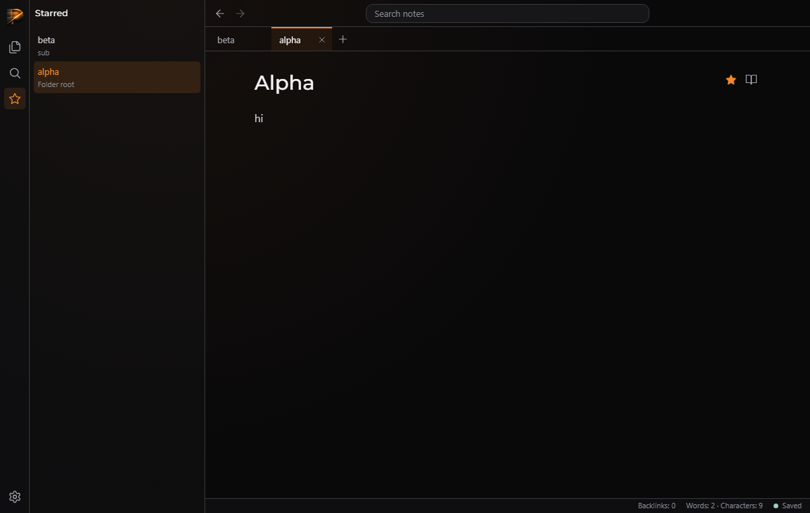
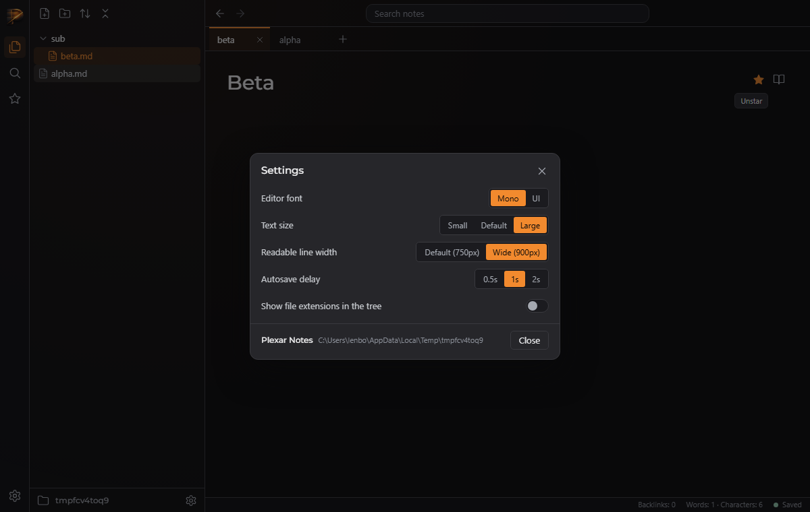
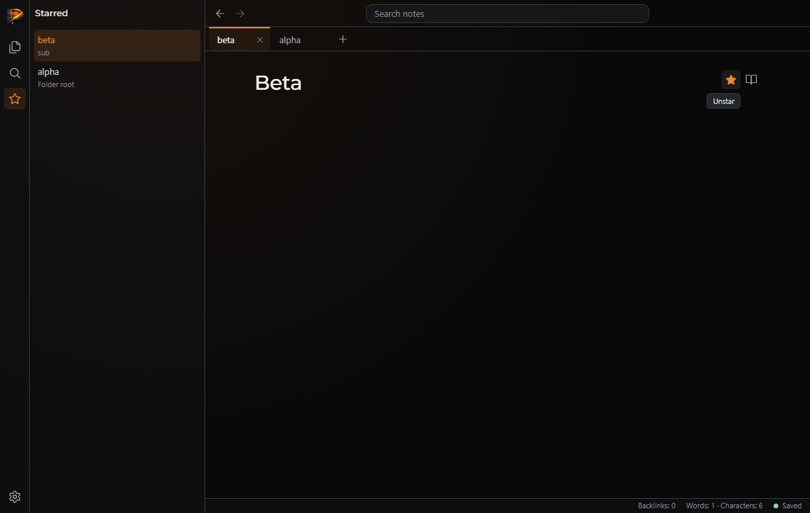

# QA — T-ca1c0c0b69

> **About this report.** The review chain ran, checked and photographed this work to get you through QA faster, and it is usually right. It is still AI judgement, and it is not a replacement for yours: results depend on how the task was prompted and on your project, and what works reliably for us may not for you. **Treat every AI verdict below as a lead to confirm, not a sign-off.** Your verdicts are recorded, and they are what makes the next report more accurate.

Generated 2026-09-26T10:47:27-04:00 by the review chain.

**Task:** This repo is Plexar Notes, a desktop-style Markdown note taker laid out like Obsidian, with a Plexar look. Browser app in public/ (ES modules under public/js: app.js, state.js, tree.js, tabs.js, history.js, icons.js, render.js, editor.js, search.js; css under public/css). The left ribbon has icon buttons Files, Search, Starred, Settings; Files toggles the explorer, Search focuses the search box; Starred and Settings are placeholders. The explorer's bottom 'Settings' icon should open the same settings panel. State persists in localStorage via state.js.  THE LOOK: tests/style.test.js scans every

**Branch:** `plexar/T-ca1c0c0b69` · **commit:** `b8dbbb9f2292` · **chain result:** `approved`

Record your verdict per case in `/app` (open the task, then *QA cases*), or edit *Your status* here.

## 1 · Seen by the AI: confirm what it claims to see (VISUAL)

| ID | Section | Test | Class | AI verdict | Your status | What the AI observed | Commit | What & how to test |
|---|---|---|---|---|---|---|---|---|
| QA-2 | Starred | Star notes, Starred panel lists them with folder paths, ribbon shows active | VISUAL | pass | PENDING | 2 items, folder paths dim, ribbon star active, filled accent star | b8dbbb9f22 | python qa/evidence/T-ca1c0c0b69/drive_verify.py — expect: 2 items titled Starred, filled star |
| QA-3 | Settings | Dialog opens from explorer Settings, settings apply and persist, Escape closes | VISUAL | pass | PENDING | --text-scale 1.12, --line-width 900px after reload, .md shown after reload, Escape closes | b8dbbb9f22 | same driver — expect: CSS vars change, persist after reload, extensions shown |
| QA-4 | Tooltips | data-tip tooltip renders via ::after on hover | VISUAL | pass | PENDING | tip content Unstar; bubble visible in screenshot | b8dbbb9f22 | same driver — expect: ::after content Unstar and visible bubble |

**QA-2** — Star notes, Starred panel lists them with folder paths, ribbon shows active



**QA-3** — Dialog opens from explorer Settings, settings apply and persist, Escape closes



**QA-4** — data-tip tooltip renders via ::after on hover



## 2 · Needs your eyes: the AI could not capture it (MANUAL)

None.

## 3 · Proven by a command (AUTO: backend smoke)

Re-runnable; these belong in the larger QA as regression checks. Spot-check any you doubt.

| ID | Section | Test | Class | AI verdict | Your status | What the AI observed | Commit | What & how to test |
|---|---|---|---|---|---|---|---|---|
| QA-1 | tests | Full suite including tests/ui.panels.test.js | AUTO | pass | VERIFIED (chain) | 172 pass, 0 fail | b8dbbb9f22 | node --test — expect: exit 0 |

## The chain, hop by hop

| hop | attempt | stage | model | verdict | judgement | feedback |
|---|---|---|---|---|---|---|
| 1 | 1 | verifier | sonnet | **fail** | Starring, the Starred panel, the settings dialog and the tooltips work in the browser, but 'Show file extensions in the tree' has no visible effect: the server already strips .md from tree names, so the tree never shows extensions. | The 'Show file extensions in the tree' setting has no visible effect. lib/tree.js builds each file node's name with displayName() (line 71), which strips '.md', so labelFor() in public/js/tree.js never sees an extension. Fix it by deriving the label from node.path (its basename, keeping or stripping '.md'), or by having the tree API return the real file name. Then confirm in a browser that togglin |
| 2 | 2 | verifier | sonnet | **pass** | node --test is green (172/172) and a real Playwright run confirmed starring, the Starred panel, the settings dialog with immediate and persistent settings, and data-tip tooltips. |  |
| 3 | 2 | approver | opus | **approve** | All four parts of the task are in the code. `node --test` passes 172/172 when I run it, and the screenshots show the starred panel (folder paths dimmed, filled accent star) and the settings dialog with every required option plus the About line. No icon button relies on `title` any more; the ones left are on non-icon elements, and 'vault' does not appear anywhere under `public/`. |  |

## Evidence the reviewers recorded

**hop 1 (verifier)** `node --test`

```
tests 170, pass 170, fail 0
```

**hop 1 (verifier)** `python qa/evidence/T-ca1c0c0b69/drive_panels.py`

```
star toggle, Starred panel, tooltip, settings changes and persistence passed; asserting 'alpha.md' in the tree after enabling extensions failed
```

**hop 1 (verifier)** `curl localhost:4873/api/tree`

```
file names are already extension-less: {"name":"alpha","path":"alpha.md"}
```

**hop 1 (verifier)** `playwright: click #setting-extensions, read #tree text`

```
localStorage settings.showExtensions=true but tree text is 'sub\nalpha'
```

**hop 2 (verifier)** `node --test`

```
tests 172, pass 172, fail 0
```

**hop 2 (verifier)** `python qa/evidence/T-ca1c0c0b69/drive_verify.py`

```
path colour rgb(138,142,151); tip "Unstar"; --text-scale 1.12; ended with OK (all asserts passed incl. reload persistence of 900px and .md extensions)
```

**hop 3 (approver)** `node --test`

```
tests 172, pass 172, fail 0
```

**hop 3 (approver)** `grep -rn 'title="|.title =' public/index.html public/js`

```
Only non-icon elements are left: the folder-name span, the resizer, the backlinks text button, the list items in backlinks/menu/search, and document.title. Every icon button uses data-tip.
```

**hop 3 (approver)** `grep -rni vault public | grep -v vendor`

```
no matches
```

**hop 3 (approver)** `grep icon-btn in public/js (tabs.js, starred.js, menu.js)`

```
Every icon button created in JS sets both aria-label and dataset.tip.
```

**hop 3 (approver)** `Read v1_starred_panel.png, v3_settings.png`

```
Starred panel with 'Starred' header, rows beta/sub and alpha/Folder root with the active row highlighted, filled accent star beside the read toggle, ribbon star active. The settings dialog has all 5 settings, 'Plexar Notes' plus the folder path in the footer, a Close button, and the 'Unstar' data-tip tooltip.
```

