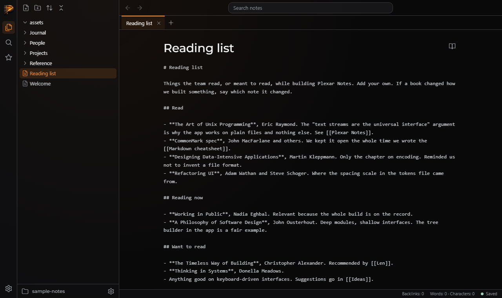

# QA — T-d8a22268fd

> **About this report.** The review chain ran, checked and photographed this work to get you through QA faster, and it is usually right. It is still AI judgement, and it is not a replacement for yours: results depend on how the task was prompted and on your project, and what works reliably for us may not for you. **Treat every AI verdict below as a lead to confirm, not a sign-off.** Your verdicts are recorded, and they are what makes the next report more accurate.

Generated 2026-09-26T09:36:38-04:00 by the review chain.

**Task:** This repo is Plexar Notes, a desktop-style Markdown note taker laid out like Obsidian with fewer features, and it must look like a Plexar product. `node server/server.js [folder]` serves public/ at http://localhost:3000 (default folder sample-notes/; if sample-notes/ is empty, create two or three throwaway .md files in a temp folder to test with, do not commit them). Routes today: GET /api/tree → {folder, root, tree:[{name,path,type,children}]} (folders first; names without .md; ?sort=name-asc|name-desc|modified-desc|modified-asc), GET /files/<path>, static /css /js /vendor /brand /lib. lib/tr

**Branch:** `plexar/T-d8a22268fd` · **commit:** `7b004f03eca7` · **chain result:** `approved`

Record your verdict per case in `/app` (open the task, then *QA cases*), or edit *Your status* here.

## 1 · Seen by the AI: confirm what it claims to see (VISUAL)

| ID | Section | Test | Class | AI verdict | Your status | What the AI observed | Commit | What & how to test |
|---|---|---|---|---|---|---|---|---|
| QA-2 | shell | Browse, open note, tabs, sort, resize, reload persistence, Ctrl+W/P, ribbon toggle | VISUAL | pass | PENDING | all passed; screenshot shows accent active file/tab, Montserrat title, raw text, status bar | 7b004f03ec | python qa/evidence/T-d8a22268fd/drive_shell.py 3457 (server on PORT=3457) — expect: all asserts pass |

**QA-2** — Browse, open note, tabs, sort, resize, reload persistence, Ctrl+W/P, ribbon toggle



## 2 · Needs your eyes: the AI could not capture it (MANUAL)

| ID | Section | Test | Class | AI verdict | Your status | What the AI observed | Commit | What & how to test |
|---|---|---|---|---|---|---|---|---|
| QA-3 | shell | Before-task comparison, arrow-key tree navigation, middle-click close | MANUAL | pass | PENDING | Not run by the verifier | 7b004f03ec | Not captured. Open the app, use arrow keys and Enter in the tree, and middle-click a tab. — expect: Keys move and open; middle-click closes the tab |

## 3 · Proven by a command (AUTO: backend smoke)

Re-runnable; these belong in the larger QA as regression checks. Spot-check any you doubt.

| ID | Section | Test | Class | AI verdict | Your status | What the AI observed | Commit | What & how to test |
|---|---|---|---|---|---|---|---|---|
| QA-1 | tests | Full test suite | AUTO | pass | VERIFIED (chain) | 121 pass, 0 fail | 7b004f03ec | node --test — expect: exit 0 |

## The chain, hop by hop

| hop | attempt | stage | model | verdict | judgement | feedback |
|---|---|---|---|---|---|---|
| 1 | 1 | verifier | sonnet | **pass** | The shell works in a real browser: layout, tree, tabs, sort, resize clamp, reload persistence, shortcuts and ribbon toggle all passed asserts with no console errors or bad responses, and node --test is green. |  |
| 2 | 1 | approver | opus | **approve** | All shell regions, modules, the tree's keyboard and persistence behaviour, tabs, history and the style rules are implemented as specified; the tests are green and every referenced asset is served with 200. |  |

## Evidence the reviewers recorded

**hop 1 (verifier)** `node --test`

```
pass 121 fail 0
```

**hop 1 (verifier)** `python qa/evidence/T-d8a22268fd/drive_shell.py 3457`

```
all 16 checks ok, no JS errors, no 4xx/5xx
```

**hop 2 (approver)** `node --test | tail`

```
tests 121, pass 121, fail 0
```

**hop 2 (approver)** `cat public/js/tree.js tests/ui.shell.test.js; sed -n 95,140p public/js/tabs.js`

```
tree.js: role=tree, chevrons with an .open rotate class, arrow/Home/End/Enter keys, active class on the open file; test covers the 8 ids, tokens link, mark.png, module script, vault scan, icons currentColor/no hex fill, CSS needles; tabs render close buttons, a + New tab button and an active class
```

**hop 2 (approver)** `node server/server.js & curl each asset`

```
/, /css/{app,layout,ribbon,explorer,tabs,note}.css, /js/{app,icons,state,tabs,tree,history}.js, /brand/mark.png, /brand/plexar-tokens.css, /api/tree?sort=modified-desc all 200
```

