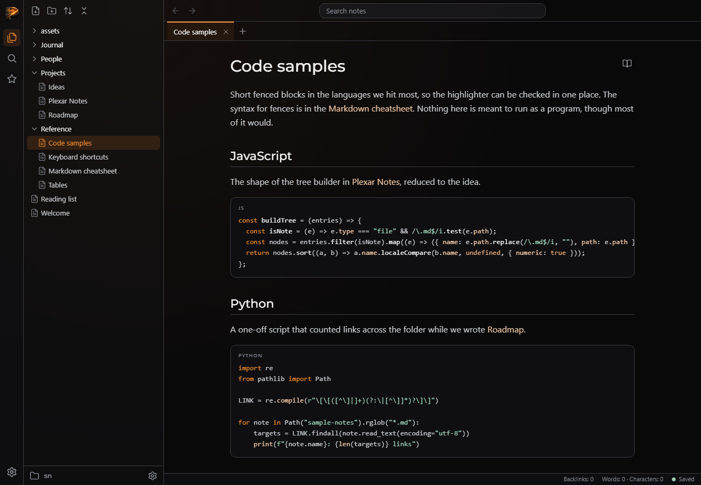
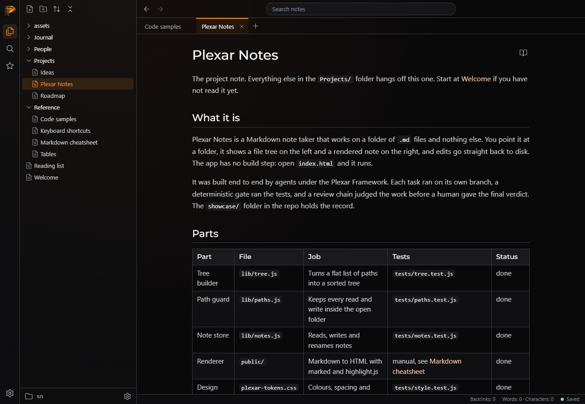
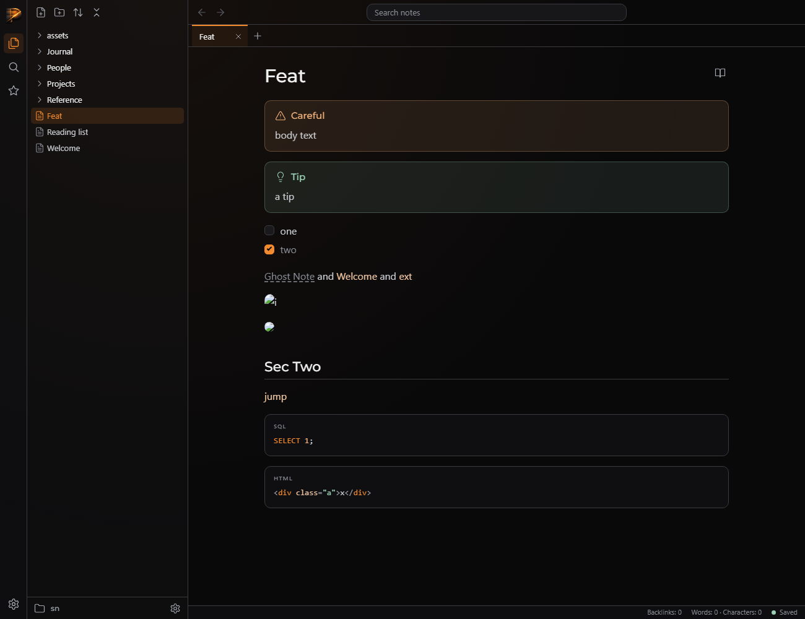

# QA — T-f998b4030c

> **About this report.** The review chain ran, checked and photographed this work to get you through QA faster, and it is usually right. It is still AI judgement, and it is not a replacement for yours: results depend on how the task was prompted and on your project, and what works reliably for us may not for you. **Treat every AI verdict below as a lead to confirm, not a sign-off.** Your verdicts are recorded, and they are what makes the next report more accurate.

Generated 2026-09-26T09:50:29-04:00 by the review chain.

**Task:** This repo is Plexar Notes, a desktop-style Markdown note taker laid out like Obsidian, with a Plexar look. Server: `node server/server.js [folder]` on http://localhost:3000 (default sample-notes/). API: GET /api/tree, GET /api/file?path= → {path, content, mtime}, PUT /api/file {path, content}, POST /api/file {path, content?} creates, GET /files/<path> raw files. Browser app in public/ (ES modules: app.js, state.js, tree.js, tabs.js, history.js, icons.js; css under public/css). Vendor: public/vendor/marked/marked.esm.js (ES module, `import { marked } from`) and public/vendor/highlight/highlight

**Branch:** `plexar/T-f998b4030c` · **commit:** `39e8813916ff` · **chain result:** `approved`

Record your verdict per case in `/app` (open the task, then *QA cases*), or edit *Your status* here.

## 1 · Seen by the AI: confirm what it claims to see (VISUAL)

| ID | Section | Test | Class | AI verdict | Your status | What the AI observed | Commit | What & how to test |
|---|---|---|---|---|---|---|---|---|
| QA-1 | Code blocks | Reference/Code samples.md renders highlighted code cards with language label and Copy | VISUAL | pass | PENDING | Screenshot shows the JS and Python cards with small-caps labels and coloured tokens; Copy button changed to Copied | 39e8813916 | python qa/evidence/T-f998b4030c/drive_reading.py — expect: Cards with language label, coloured tokens, Copy shows Copied |
| QA-2 | Typography and tables | Projects/Plexar Notes.md headings, inline code, table | VISUAL | pass | PENDING | Matches; borders on every cell, header row on surface, zebra rows | 39e8813916 | same driver — expect: Montserrat headings, bordered table with header row on surface, inline code chips |
| QA-3 | Callouts, tasks, links, sanitising | Callouts, tasks, missing wikilink, confirm bar, task save, script stripping | VISUAL | pass | PENDING | All asserts passed; screenshots show callouts, checkboxes, dashed missing link | 39e8813916 | python qa/evidence/T-f998b4030c/drive_features.py — expect: Tinted callouts with icons, accent checkbox, dashed missing link, in-app confirm and create, task persisted, scripts and onerror stripped |

**QA-1** — Reference/Code samples.md renders highlighted code cards with language label and Copy



**QA-2** — Projects/Plexar Notes.md headings, inline code, table



**QA-3** — Callouts, tasks, missing wikilink, confirm bar, task save, script stripping



## 2 · Needs your eyes: the AI could not capture it (MANUAL)

None.

## 3 · Proven by a command (AUTO: backend smoke)

Re-runnable; these belong in the larger QA as regression checks. Spot-check any you doubt.

| ID | Section | Test | Class | AI verdict | Your status | What the AI observed | Commit | What & how to test |
|---|---|---|---|---|---|---|---|---|
| QA-4 | Tests | Full test suite | AUTO | pass | VERIFIED (chain) | 128 pass, 0 fail | 39e8813916 | node --test — expect: exit 0 |

## The chain, hop by hop

| hop | attempt | stage | model | verdict | judgement | feedback |
|---|---|---|---|---|---|---|
| 1 | 1 | verifier | sonnet | **pass** | The reading view works when run: code samples, the Plexar Notes note, callouts, tasks, missing-wikilink confirm and create, sanitising, and image and heading rewrites all behaved as specified. `node --test` passes with 128 tests and no page errors in the browser runs. Ctrl+click on a wikilink was not confirmed, and the before-task screenshot was not captured. |  |
| 2 | 1 | approver | opus | **approve** | The change covers every requirement and `node --test` passes 128/128 when I re-ran it. The verifier did not confirm Ctrl+click; the code shows it opens the note in a new tab without switching, because the current tab always has a note open when a link is clicked and only the tab list is saved. The callout icon and Copy button string matches line up with lib/markdown.js output. |  |

## Evidence the reviewers recorded

**hop 1 (verifier)** `node --test`

```
tests 128, pass 128, fail 0
```

**hop 1 (verifier)** `python qa/evidence/T-f998b4030c/drive_reading.py`

```
Code samples: 3+ .codeblock and .hljs-keyword present, Copy button shows 'Copied'; Plexar Notes renders table, inline code, 7 resolved wikilinks; errs []
```

**hop 1 (verifier)** `python qa/evidence/T-f998b4030c/drive_features.py`

```
2 callouts; window.pwn undefined and no [onerror] or script elements; img src /files/assets/x.png; external link target=_blank rel=noopener; h2 id sec-two; task toggle PUT '- [x] one' to the file; confirm text 'Create "Ghost Note"?'; Cancel hides the bar; Create writes Ghost Note.md and opens it; errs []
```

**hop 2 (approver)** `node --test`

```
tests 128, pass 128, fail 0
```

**hop 2 (approver)** `grep lib/markdown.js exports/markup and openInTabs in public/js/tabs.js`

```
wikiLinksToHtml emits data-target/data-path; callout markup '<div class="callout callout-${t}" data-type="${t}"><div class="callout-title">' and copy button '<button class="copy" type="button" aria-label="Copy code">Copy</button>' match render.js; openInTabs only reuses the active tab when its path is null, otherwise splices a new tab
```

